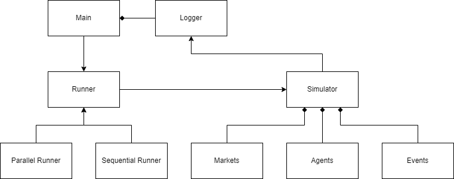

Platform
=======================

Class architecture
~~~~~~~~~~~~~~~~~~~~~~~~~
The following code is typical lines in main file:

.. code-block:: python

    runner = SequentialRunner(
        settings=setting_dict_or_json,
        prng=random.Random(seed),
        logger=MarketStepPrintLogger(),
    )
    runner.main()

As this code representing, the simulation is fully controlled by a runner, in this case, :class:`SequentialRunner` .
:class:`Runner` usually accepts setting dictionary, a pseudo random number generator, and a logger.

The following figure shows the class architecture.

Main usually has a logger and generating runner.
As a runner, Parallel Runner or Sequential Runner is available.
Runner will generate simulator and some other components such as markets, agents, and events.
Then, runner control all the components and simulator for it rule.
On the other hand, simulator provide API interface for runners to define the procedure controlling simulation.
Moreover, simulator and its components generate logs and push it to logger.

The key concept of this platform is that runner is replaceable to realize more complex simulator controlling.

Parallel runners
~~~~~~~~~~~~~~~~~~~~~~~~~
:class:`pams.runners.MultiThreadAgentParallelRunner` and :class:`pams.runners.MultiProcessAgentParallelRunner` are experimental runners
that parallelize the order submissions of normal (non high-frequency) agents in each step.
They are drop-in replacements of :class:`pams.runners.SequentialRunner`, and the simulation results are the same as
:class:`pams.runners.SequentialRunner` with the same settings and the same seed.
The number of workers can be set by ``simulation.numParallel`` in the config, but the number of agents that can be
parallelized in each step is limited by ``maxNormalOrders`` of the session.

.. code-block:: python

    runner = MultiThreadAgentParallelRunner(
        settings=setting_dict_or_json,
        prng=random.Random(seed),
        logger=MarketStepPrintLogger(),
    )
    runner.main()

Because of the GIL of python, :class:`pams.runners.MultiThreadAgentParallelRunner` is beneficial only when
the order submission of agents waits for I/O (e.g., external models or services).
:class:`pams.runners.MultiProcessAgentParallelRunner` copies the whole simulation to the worker processes in every step,
so it is much slower and the user-defined classes must be picklable and importable from the worker processes.
How it starts the worker processes (``spawn``, ``fork`` or ``forkserver``) can be set by ``simulation.startMethod``
in the config. See :ref:`config-parallel` for the details and the cost of the copies.

Customizing the workers
^^^^^^^^^^^^^^^^^^^^^^^^^
Subclasses of the parallel runners can customize the workers by overriding the following members.

- ``default_start_method`` (class attribute, process runner only): the start method used when
  ``simulation.startMethod`` is not set. The default, ``None``, means the platform's default. The start method in use
  is stored in ``start_method``.
- ``_get_mp_context()`` (process runner only): the :mod:`multiprocessing` context of the worker processes.
  The default is ``multiprocessing.get_context(self.start_method)``.
- ``_get_worker_initializer()`` and ``_get_worker_initargs()``: a function called once on each worker (thread or
  process) before it runs any task, and its arguments. By default, nothing is called. With the process runner,
  the function must be defined at the top level of a module that the worker processes can import, and the
  arguments must be picklable. If the function raises an error on a worker, the tasks on that worker raise a
  ``RuntimeError`` caused by the error, and the simulation fails.
- ``_create_executor()``: the :class:`concurrent.futures.Executor` that runs the tasks. The default creates
  ``_parallel_pool_provider`` (:class:`concurrent.futures.ThreadPoolExecutor` or
  :class:`concurrent.futures.ProcessPoolExecutor`) with the members above and ``numParallel`` workers.
- ``_split_agents_into_chunks(agents)``: how the agents asked at the same time are split into tasks. The agents
  of a task are asked one by one on the same worker. The thread runner makes one task per agent, and the process
  runner makes at most ``numParallel`` tasks of consecutive agents because each task copies the whole simulation.
  The tasks must keep all the agents in the given order, so that the results stay the same as
  :class:`pams.runners.SequentialRunner`; otherwise, the simulation fails with a ``ValueError``.

For example, the following runner starts its worker processes by ``spawn`` and loads a model once in each worker
process. The agents use ``my_runner.MODEL`` in ``submit_orders`` instead of keeping the model as their attribute,
so that the model is not copied in every task.

.. code-block:: python

    # my_runner.py, which the worker processes can import
    from typing import Any, Callable, Optional, Tuple

    from pams.runners import MultiProcessAgentParallelRunner

    MODEL = None

    def load_model(path: str) -> None:
        global MODEL
        MODEL = ...  # load the model from path

    class MyRunner(MultiProcessAgentParallelRunner):
        default_start_method = "spawn"

        def _get_worker_initializer(self) -> Optional[Callable[..., Any]]:
            return load_model

        def _get_worker_initargs(self) -> Tuple[Any, ...]:
            return ("model.bin",)

JAX/Flax runner
^^^^^^^^^^^^^^^^^^^^^^^^^
:class:`pams.runners.JaxAgentParallelRunner` is an experimental :class:`pams.runners.MultiProcessAgentParallelRunner`
for agents whose ``submit_orders`` uses `JAX <https://github.com/jax-ml/jax>`_, e.g., neural network models of
`Flax <https://github.com/google/flax>`_. JAX is not a dependency of pams, so install it separately, e.g.,
``pip install jax flax`` (see the `JAX installation guide <https://docs.jax.dev/en/latest/installation.html>`_
for GPUs). ``import pams`` does not import JAX, and creating the runner without JAX raises an ``ImportError``.

- The worker processes are started by ``spawn`` by default (``default_start_method = "spawn"``), because ``fork``
  is unsafe once JAX runs its own threads: a forked worker process can deadlock on a lock held by one of them.
- Each worker process configures JAX once before it runs any task, by ``simulation.jaxPlatforms``,
  ``simulation.jaxPreallocate`` and ``simulation.jaxMemoryFraction`` (see :ref:`config-parallel-jax`), and then
  calls the worker initializer given by ``_get_worker_initializer()``, e.g., ``load_model`` above.
  The preallocation of GPU memory is disabled by default, so that the worker processes can share a GPU.
  The main process is not configured, so set ``XLA_PYTHON_CLIENT_PREALLOCATE=false`` in the environment too if
  the agents use JAX on a GPU when they are created on the main process.
- The worker processes persist during the simulation, so a function compiled by :func:`jax.jit` is compiled once
  per worker process at its first call and reused in the following steps. Compiled functions cannot be pickled:
  define them at the top level of a module instead of keeping them as attributes of the agents.
- The jax arrays, Flax modules and parameters that the agents hold are pickled in every task (see
  :ref:`config-parallel`) and copied to the default device of the worker process. Load large or read-only models
  once per worker process with the worker initializer instead.
- Do not run JAX (e.g., create jax arrays) at the top level of the modules that the worker processes import, such
  as the main script, and do not pass jax arrays to the worker initializer; otherwise, JAX is initialized before
  it is configured.
- Derive the random numbers, including the keys of :mod:`jax.random`, from ``agent.prng``, so that the results are
  the same as :class:`pams.runners.SequentialRunner`.

.. code-block:: python

    # my_agent.py, which the worker processes can import
    import flax.linen as nn
    import jax
    import jax.numpy as jnp

    from pams.agents import Agent

    class Model(nn.Module):
        @nn.compact
        def __call__(self, x):
            return nn.Dense(1)(x)

    @jax.jit
    def predict(params, x):  # compiled once per worker process
        return Model().apply(params, x)

    class MyFlaxAgent(Agent):
        def setup(self, settings, accessible_markets_ids, *args, **kwargs):
            super().setup(settings, accessible_markets_ids, *args, **kwargs)
            key = jax.random.PRNGKey(self.prng.randrange(2**31))
            self.params = Model().init(key, jnp.zeros((3,)))  # pickled in every task

        def submit_orders(self, markets):
            ...  # e.g., predict(self.params, features)

.. code-block:: python

    # main.py
    import random

    from my_agent import MyFlaxAgent
    from pams.runners import JaxAgentParallelRunner

    if __name__ == "__main__":
        runner = JaxAgentParallelRunner(settings=config, prng=random.Random(42))
        runner.class_register(MyFlaxAgent)
        runner.main()

