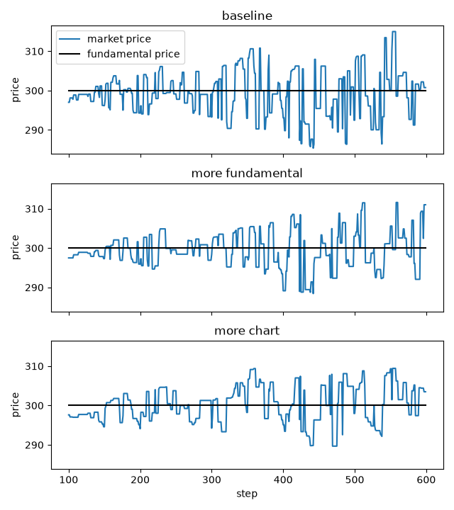

.. _tutorial-ci2002:

Fundamentalists, chartists and noise traders
============================================

This tutorial follows the Plham tutorial of the same model
(`CI2002Main <https://plham.github.io/tutorial/CI2002Main>`__ and its
`use cases <https://plham.github.io/tutorial/CI2002Main_UseCases>`__), which is based on Chiarella and Iori (2002).
It runs one market with 100 FCN agents and asks two questions: what happens to the market price when the agents
follow the fundamental price more, and what happens when they follow the trend more?
The complete script is :download:`tutorial_ci2002.py <code/tutorial_ci2002.py>`.
It needs `matplotlib <https://matplotlib.org/>`_ for the plot, which is not installed with PAMS
(``pip install matplotlib``).

The model
---------

Each :class:`~pams.agents.FCNAgent` mixes three ways to predict the price.
The **fundamental** part expects the market price :math:`P_t` to move back to the fundamental price
:math:`P^f_t`. The **chart** part expects the recent trend to go on. The **noise** part is a random guess.
The agent weights the three parts with :math:`w_F`, :math:`w_C` and :math:`w_N` and computes an expected return
(slightly simplified here; the exact formula is in the FCNAgent section of :ref:`config-agents`)

.. math::

   \hat{r} = \frac{1}{w_F + w_C + w_N}
   \left(
   w_F \frac{1}{\tau_r} \ln\frac{P^f_t}{P_t}
   + w_C \frac{1}{\tau} \ln\frac{P_t}{P_{t-\tau}}
   + w_N \sigma_N \varepsilon
   \right),
   \qquad \varepsilon \sim \mathcal{N}(0, 1),

where :math:`\tau` is ``timeWindowSize``, :math:`\tau_r` is ``meanReversionTime`` and :math:`\sigma_N` is
``noiseScale``.
If the expected price :math:`P_t \exp(\hat{r} \tau)` is above the market price, the agent places a buy order
below the expected price. If it is below, the agent places a sell order above it. ``orderMargin`` sets how far
from the expected price the order is placed.

Each agent draws its own weights when the simulation is set up (see :ref:`config-jsonrandom`).
A group with a larger mean ``fundamentalWeight`` behaves more like fundamentalists, and a group with a larger
mean ``chartWeight`` behaves more like chartists.

The configuration
-----------------

The script uses the configuration of ``samples/CI2002`` as a Python dict:

.. literalinclude:: code/tutorial_ci2002.py
   :language: python
   :start-after: # [config-start]
   :end-before: # [config-end]

It is the *Minimal* configuration of :ref:`config-quickstart`, which :doc:`first_simulation` also uses, with
three differences:

- ``meanReversionTime`` sets :math:`\tau_r`, the time scale of the fundamental part. Each agent gets a value from
  50 to 99 steps. Without it, :math:`\tau_r` is the agent's ``timeWindowSize`` (100 to 199 steps).
- The sessions are named ``0`` and ``1``, as in Plham, instead of ``warmup`` and ``main``.
- ``highFrequencySubmitRate`` of the first session has no effect: 1.0 is the default, and there are no
  high-frequency agents.

``chartWeight`` is ``{"expon": [0.0]}``, which is always 0. The agents of the sample are fundamentalists and
noise traders only.

The three cases
---------------

Each case changes some keys of the ``FCNAgents`` block:

.. literalinclude:: code/tutorial_ci2002.py
   :language: python
   :start-after: # [cases-start]
   :end-before: # [cases-end]

- ``baseline`` is the sample itself.
- ``more fundamental`` doubles the mean fundamental weight, from 1.0 to 2.0.
- ``more chart`` gives the agents a chart weight with mean 0.5.

Running the cases
-----------------

``make_config`` copies the configuration and changes the ``FCNAgents`` block, so ``CONFIG`` itself stays the
same. ``run_simulation`` runs one case with one seed:

.. literalinclude:: code/tutorial_ci2002.py
   :language: python
   :start-after: # [run-start]
   :end-before: # [run-end]

The script measures how the market price moves around the fundamental price in the main session (steps 100 to
599):

.. literalinclude:: code/tutorial_ci2002.py
   :language: python
   :pyobject: deviation_stats

- ``std`` and ``max`` show how far the market price goes from the fundamental price.
- ``crosses`` counts how many times the market price passes the fundamental price. Fewer crosses mean that the
  price stays on one side for longer, that is, longer trends.
- ``volume`` is the number of shares traded.

``main()`` runs the three cases with the ten seeds 42 to 51. It prints the results of seed 42 and the mean over
the ten seeds, and plots seed 42.

Results
-------

``python tutorial_ci2002.py`` prints the two tables:

.. code-block:: text

   seed 42
   case                std    max  crosses  volume
   baseline           5.73  14.99     77.0   207.0
   more fundamental   4.66  11.58     53.0   170.0
   more chart         4.61  10.32     49.0   167.0
   mean of seeds 42 to 51
   case                std    max  crosses  volume
   baseline           6.46  14.65     79.6   213.4
   more fundamental   4.75  10.90     69.1   173.6
   more chart         5.22  11.98     50.3   175.3

and saves ``ci2002_weights.png``, the market price of seed 42 in the three cases:

         from step 100 to step 599

Use the mean over the seeds to compare the cases. With seed 42 alone, ``more chart`` has a smaller ``std`` than
``more fundamental``, but not on average.

More fundamentalists
   The market price stays closer to the fundamental price: ``std`` falls from 6.46 to 4.75 and ``max`` from 14.65
   to 10.90. The agents pull the price back to 300 more strongly, so the price makes only small moves around it.
   This is the answer of the Plham tutorial too.

More chartists
   ``crosses`` falls from 79.6 to 50.3: once the price has moved away from the fundamental price, it stays on
   that side for longer, because the chart part expects the trend to go on. Plham also finds longer trends.
   In this setup, however, ``std`` does not grow: it falls from 6.46 to 5.22.
   A possible reason is in the formula: the weights are divided by their sum, so a chart weight also makes the
   noise part smaller.

In both cases, fewer shares are traded.
Try other values, for example a larger ``chartWeight`` or a smaller ``noiseWeight``, and compare the tables.

Differences from Plham
----------------------

- PAMS and Plham use different random number generators, so the same configuration and seed give different
  prices.
- The Plham tutorial answers its questions with plots of the prices. This tutorial also measures how the market
  price moves around the fundamental price, and averages the numbers over ten seeds.

References
----------

- Chiarella, C. and Iori, G. (2002). A simulation analysis of the microstructure of double auction markets.
  *Quantitative Finance*, 2(5), 346–353. https://doi.org/10.1088/1469-7688/2/5/303
