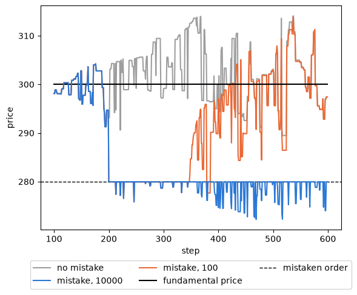
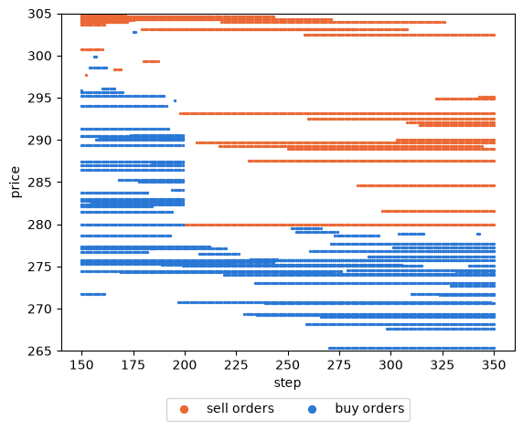

.. _tutorial-fat-finger:

A fat-finger order
==================

A fat-finger error is an order typed by mistake, with a wrong price or a much larger volume than intended.
This tutorial places one very large sell order below the market price in the simulation of
:doc:`first_simulation`, records the order book around it, and asks how long the market takes to recover and how
the answer depends on the size of the mistake.
It follows the fat-finger tutorial of Plham (`FatFingerMain <https://plham.github.io/tutorial/FatFingerMain>`__
and its `use cases <https://plham.github.io/tutorial/FatFingerMain_UseCases>`__).
The complete script is :download:`tutorial_fat_finger.py <code/tutorial_fat_finger.py>`.
It needs `matplotlib <https://matplotlib.org/>`_ for the plots, which is not installed with PAMS
(``pip install matplotlib``).

The model
---------

The market and the 100 :class:`~pams.agents.FCNAgent` agents are those of :doc:`first_simulation`. Each agent
expects a price from a fundamental term and a noise term (the FCN model of Chiarella and Iori, 2002, with the chart
weight set to 0), and in each step one of them places a limit order of one share around its expected price. The
fundamental price stays at 300.

The mistake is the built-in :class:`~pams.events.OrderMistakeShock` event. At its trigger step, it takes the first
order that reaches the target market and replaces it with a limit order of ``orderVolume`` shares at
:math:`P (1 + r)`, where :math:`P` is the current market price and :math:`r` is ``priceChangeRate``. A negative
:math:`r` gives a sell order, a positive one a buy order. The agent that sent the original order owns the mistaken
one, and the order stays in the book for ``orderTimeLength`` steps unless it is executed.

The configuration
-----------------

The configuration is that of ``samples/fat_finger`` without its comments. The second session
(``"sessionName": 1``) lists the event, and the event block sets a sell order of 10000 shares at 5% below the
market price, with a lifetime of 10000 steps:

.. literalinclude:: code/tutorial_fat_finger.py
   :language: python
   :start-after: # [config-start]
   :end-before: # [config-end]

``triggerTime`` is counted from the start of the session, which is step 100, so the mistake happens at step 200.
All the keys are described in :ref:`config-events`. Apart from the event, this is the configuration of
:doc:`first_simulation` with other session names and an ``outstandingShares`` key, which do not change the run.
The script also runs it without the mistake by setting ``enabled`` to ``False``: the event then registers no hooks
and is not added to the simulator, and the market prices are exactly those of :doc:`first_simulation` with the
same seed.

Recording the order book
------------------------

The default logger does not keep the order book, so the script uses its own logger (see :doc:`custom_logger`). It
keeps every order and every execution, and the volume at each price of both sides of the book at the end of each
step:

.. literalinclude:: code/tutorial_fat_finger.py
   :language: python
   :start-after: # [recorder-start]
   :end-before: # [recorder-end]

The market rounds the price of an order to its tick size before it logs the order, so the prices in the order logs
are those of the book. The books are dicts from a price to the volume of the orders at that price; the key
``None`` would collect market orders, which the FCN agents do not place.

Two small functions find the mistaken order and count the part of it that is still in the book:

.. literalinclude:: code/tutorial_fat_finger.py
   :language: python
   :start-after: # [wall-start]
   :end-before: # [wall-end]

Only one order is placed per step (``maxNormalOrders`` is 1), so the order logged at the trigger step is the
mistaken one. Running the script with seed 42 first prints the mistaken order, then the market price, the best
prices, the volume on each side of the book and what is left of the mistaken order at the end of a few steps:

.. code-block:: text

   mistaken order: FCNAgents-28 sells 10000 at 279.95251 in step 200
   step    price  best buy  best sell  buy volume  sell volume  wall left
    199  294.687   290.590    293.116          28           39          -
    200  279.963   277.361    279.953          10        10021       9982
    201  279.953   277.361    279.953          10        10020       9981
    250  279.953   275.791    279.953          16         9984       9953
    400  274.649   274.508    279.953          27         9892       9874
    599  279.953   274.561    279.953          26         9803       9793

The market price at step 199 is 294.687, so the mistaken order sells at :math:`294.687 \times 0.95 = 279.953`.
At step 200 it meets every buy order at or above that price: 18 shares are executed, and the buy side of the book
falls from 28 to 10 shares. The best buy price drops from 290.590 to 277.361.
All 18 shares trade at one price, 279.963: PAMS executes all the volume matched in one step at a single price,
set by the last pair of orders matched, which here is the lowest of these buy orders.

The other 9982 shares stay in the book as a *wall*. From then on, any buy order at or above 279.953 is executed
against the wall at the wall's price, 279.953, so the market price can no longer rise above it; it only falls
below it when a sell order meets a lower buy order, as at step 400. By step 599, the buyers have taken 207 of the
10000 shares.

The price after the mistake
---------------------------

The script also runs the same seed without the mistake, and with a mistaken order of only 100 shares, and
compares the market prices of steps 201 to 599 and the volume traded in them:

.. code-block:: text

   steps 201-599        min      max     last  volume
   no mistake         289.481  314.085  297.401     149
   mistake, 10000     272.227  279.953  279.953     245
   mistake, 100       275.821  313.867  297.396     192

         200. The run with 10000 shares then stays at or below the dashed line of the mistaken order near 280,
         the run with 100 shares climbs back to about 300 after step 350, and the run without the mistake
         stays around the fundamental price of 300.

With 10000 shares, the price never exceeds the price of the mistaken order from step 201 on, and ends the run 7%
below the fundamental price. The FCN agents expect the price to return to 300 and send many buy orders, which is
why more shares are traded than without the mistake, but one share at a time they cannot absorb the wall: at about
one share every two steps, the 9793 shares left would last about 19000 more steps, longer than the order's
lifetime.
With 100 shares, the wall is used up at step 347 and the price returns to the level of the run without the mistake.

How large must the mistake be?
------------------------------

One run is one path. The script repeats the runs with seeds 42 to 51, with mistaken orders of 10000, 100 and 10
shares and without the mistake, and records the step at which the mistaken order is used up and the mean market
price of steps 500 to 599:

.. literalinclude:: code/tutorial_fat_finger.py
   :language: python
   :start-after: # [volumes-start]
   :end-before: # [volumes-end]

.. code-block:: text

   volume  used up  mean step  mean price 500-599
    10000     0/10          -              281.81
      100    10/10      437.7              294.94
       10    10/10      205.9              298.55
     none        -          -              298.43

The 10000-share order is never used up, and the mean price of steps 500 to 599 is about 6% below the fundamental
price. An order of 100 shares is used up in every run, on average about 240 steps after the mistake, and the mean
price of steps 500 to 599 is only 3.5 lower than without the mistake. An order of 10 shares is used up about 6
steps after the mistake on average, and leaves no trace in the late prices. The size of the mistake, compared with
the flow of buy orders that can absorb it, decides whether the market recovers within the run.

The order book
--------------

The recorded books show the wall directly. Each dot is a price with at least one order at the end of a step:

         lie between about 270 and 303. At step 200 the buy orders above 280 disappear, and a line of sell
         orders at 280 appears and stays until step 350, with all later buy orders below it.

Before step 200, buy orders sit up to about 303. At step 200, those above 279.953 disappear, and the mistaken
order forms a line of sell orders at 279.953 that stays for the rest of the run. The sell orders placed above it
are never reached, and new buy orders pile up below it.

Differences from Plham
----------------------

- In Plham, the configuration names an agent group (``"agent"``), and the first agent of that group places the
  mistaken order in addition to the orders of the step. In PAMS, the ``agent`` key is ignored with a warning,
  and the event replaces the first order that reaches the market at the trigger step, so the owner is whichever
  agent placed that order (here ``FCNAgents-28``).
- In the run shown by Plham, the market price falls to about 285 at the mistake. Here it falls to 279.953, 5% below
  the market price of step 199, which was already below the fundamental price.
- PAMS does not check that an agent owns the shares it sells: ``FCNAgents-28`` started with 50 shares and ends
  the run holding -155.
- Plham writes the whole order book in its output (``OrderBook#dump``) and plots it with an R script. Here, a
  logger keeps the volume at each price of the book, and matplotlib draws it.

References
----------

- Chiarella, C. and Iori, G. (2002). A simulation analysis of the microstructure of double auction markets.
  *Quantitative Finance*, 2(5), 346–353. https://doi.org/10.1088/1469-7688/2/5/303
- Plham: `FatFingerMain <https://plham.github.io/tutorial/FatFingerMain>`__ and
  `FatFingerMain_UseCases <https://plham.github.io/tutorial/FatFingerMain_UseCases>`__. Plham cites no paper
  for this case.
