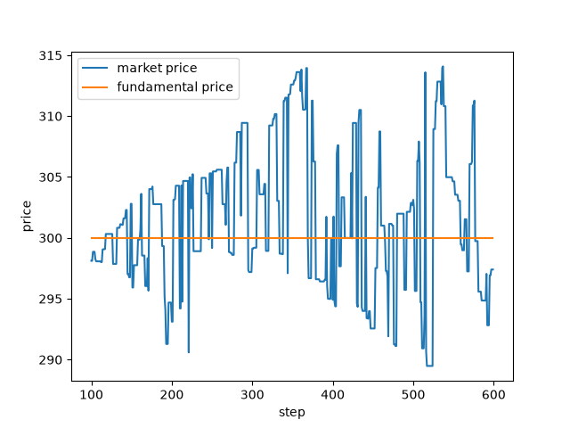

.. _tutorial-first-simulation:

Running a simulation
====================

This tutorial runs a simulation from Python, prints and saves the market prices, reads the results from the
simulator after the run, and plots them.
The complete script is :download:`tutorial_first_simulation.py <code/tutorial_first_simulation.py>`.
It needs `matplotlib <https://matplotlib.org/>`_ for the plot, which is not installed with PAMS
(``pip install matplotlib``).

The configuration
-----------------

A simulation is described by a configuration: its markets, its agents and its sessions.
This tutorial uses the *Minimal* configuration of :ref:`config-quickstart`, written as a Python dict:

.. literalinclude:: code/tutorial_first_simulation.py
   :language: python
   :start-after: # [config-start]
   :end-before: # [config-end]

It creates one market and 100 :class:`~pams.agents.FCNAgent` agents.
The ``warmup`` session (steps 0 to 99) only fills the order book, and the ``main`` session (steps 100 to 599)
also executes the orders.
Every key is explained in :ref:`config`.

The runners accept the configuration as a dict, as the path of a JSON file, or as an open JSON file, so the same
configuration saved as ``config.json`` can be run with ``SequentialRunner(settings="config.json", ...)``.

Running it
----------

:class:`~pams.runners.SequentialRunner` builds the simulation from the configuration and runs it when ``main()``
is called:

.. literalinclude:: code/tutorial_first_simulation.py
   :language: python
   :pyobject: print_prices

- ``prng`` is the random number generator of the whole simulation. The simulator and every market, agent,
  session and event get their own generator seeded from it, so a run is fully determined by the seed: the same
  seed gives the same prices. Without ``prng``, the runner uses ``random.Random()``, and every run is different.
- ``logger`` receives the logs of the simulation. :class:`~pams.logs.MarketStepPrintLogger` prints one line per
  market at the end of every step. A runner has at most one logger.

``print_prices(seed=42)`` prints:

.. code-block:: text

   0 0 0 Market 300.0 300.0
   0 1 0 Market 300.0 300.0
   0 2 0 Market 300.0 300.0
   ...
   0 99 0 Market 300.0 300.0
   1 100 0 Market 298.11165 300.0
   1 101 0 Market 298.11165 300.0
   1 102 0 Market 298.85386 300.0
   ...
   1 599 0 Market 297.40149 300.0
   # INITIALIZATION TIME 0.0029998
   # EXECUTION TIME 0.0955184

The columns are the session ID (the position of the session in ``sessions``: ``0`` for ``warmup``), the step,
the market ID, the market name, the market price and the fundamental price.
The market price stays at 300 while orders are not executed, and starts to move at step 100.
The fundamental price stays at 300 because the market has no ``fundamentalVolatility``
(see :ref:`config-markets`).
The last two lines, printed by ``main()``, are the time taken to build and to run the simulation, in seconds.
They change from run to run.

You will also see this warning:

.. code-block:: text

   UserWarning: order price does not accord to the tick size. price will be modified

It is normal: FCN agents compute prices that are not multiples of ``tickSize``, and the market rounds them
(buy orders down, sell orders up).

Saving the prices
-----------------

To use the prices in Python instead of printing them, pass a :class:`~pams.logs.MarketStepSaver`:

.. literalinclude:: code/tutorial_first_simulation.py
   :language: python
   :pyobject: run_simulation

After the run, ``saver.market_step_logs`` is a list with one dict per market and step, in the order of the
steps:

.. code-block:: python

   >>> saver.market_step_logs[100]
   {'session_id': 1, 'market_time': 100, 'market_id': 0, 'market_name': 'Market', 'market_price': 298.11165, 'fundamental_price': 300.0}

To record other data, such as every trade, write your own logger (see :doc:`custom_logger`).

Reading the results
-------------------

After ``main()`` has returned, ``runner.simulator`` still holds every market, agent and session, and the markets
keep the history of their prices and volumes:

.. literalinclude:: code/tutorial_first_simulation.py
   :language: python
   :pyobject: summarize

``print(summarize(runner))`` prints:

.. code-block:: text

   {'last_price': 297.40149, 'min_price': 289.48107000000005, 'max_price': 314.08524, 'total_volume': 205, 'total_shares': 5000}

The shares change hands but their total does not change: the 100 agents started with 50 shares each.

The simulator finds objects by name or ID:

- ``name2market``, ``name2agent`` and ``name2session`` by instance name (``"Market"``, ``"FCNAgents-0"``,
  ``"main"``), and ``id2market`` and ``id2agent`` by ID;
- ``agents_group_name2agent`` gives the agents of a group (``"FCNAgents"``);
- ``markets``, ``agents`` and ``sessions`` list all of them.

The history methods of :class:`~pams.Market` take the steps to read in ``times``.
Without ``times`` they return every step up to the current time of the market, which is 600 after this run
(one step after the last one), so use each session's ``session_start_time`` and ``iteration_steps`` to select
it, as above. Useful methods include:

.. list-table::
   :header-rows: 1
   :widths: 45 55

   * - Method
     - Returns
   * - ``get_market_prices(times)``, ``get_fundamental_prices(times)``
     - Market prices and fundamental prices.
   * - ``get_executed_volumes(times)``, ``get_executed_total_prices(times)``
     - Traded volume, and the sum of price times volume, of each step.
   * - ``get_last_executed_prices(times)``, ``get_mid_prices(times)``
     - Price of the last execution and mid price at each step. They can be ``None``: before the first
       execution, and when one side of the order book is empty.
   * - ``get_vwap(time)``
     - Volume-weighted average price from step 0 to ``time`` (NaN if nothing was traded).
   * - ``get_best_buy_price()``, ``get_best_sell_price()``
     - Best prices in the order book now (``None`` if that side is empty).

The methods ending in ``s`` also have a form for one step, such as ``get_market_price(time)``, where ``time``
defaults to the current step. Asking for a step after the current one raises
``AssertionError: Cannot refer the future parameters``.
An agent's holdings are given by ``get_cash_amount()`` and ``get_asset_volume(market_id)``.

Plotting
--------

The saved prices can be plotted with matplotlib:

.. literalinclude:: code/tutorial_first_simulation.py
   :language: python
   :pyobject: plot_prices

``plot_prices(saver, path="prices.png")`` keeps the ``main`` session (session ID 1) and writes:

Running the script
------------------

Running the complete script with ``python tutorial_first_simulation.py`` does all of the above with seed 42 and
writes ``prices.png`` to the current directory.

Next, :doc:`custom_agent` adds your own trading strategy to this simulation.
