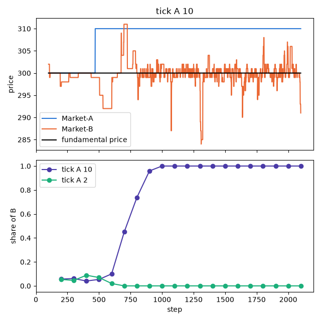
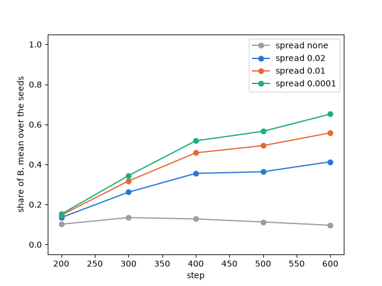

.. _tutorial-market-share:

Two markets competing for volume
================================

When one stock is traded on two exchanges, traders tend to send their orders where most of the trading already
happens, so a new exchange with a small share of the volume has a hard time taking it from the old one. This
tutorial asks what helps the smaller market: a smaller tick size than its rival, or a market maker that always
quotes in it.
It follows the market-share tutorial of Plham (`MarketShareMain <https://plham.github.io/tutorial/MarketShareMain>`__
and its use cases on the `tick size <https://plham.github.io/tutorial/MarketShareMain_UseCases01>`__ and on the
`market maker <https://plham.github.io/tutorial/MarketShareMain_UseCases02>`__), which is based on the studies
listed at the end of this page.
The complete script is :download:`tutorial_market_share.py <code/tutorial_market_share.py>`.
It needs `matplotlib <https://matplotlib.org/>`_ for the plots, which is not installed with PAMS
(``pip install matplotlib``).

The model
---------

Two markets, ``Market-A`` and ``Market-B``, trade the same stock. The traders are
:class:`~pams.agents.MarketShareFCNAgent` agents: FCN agents (Chiarella and Iori, 2002) that can trade in both
markets but send each order to only one of them. The market is drawn at random, with a weight equal to the volume
executed in that market in the current step and the ``timeWindowSize`` steps before it (plus :math:`10^{-10}`).
A market that trades more therefore receives more orders, and trades even more.

At the start, neither market has traded. The script uses the market class of ``samples/market_share``, which sets
the volume of step 0 from the key ``tradeVolume`` (see :ref:`tutorial-custom-event` for how to write a market):

.. literalinclude:: code/tutorial_market_share.py
   :language: python
   :start-after: # [market-start]
   :end-before: # [market-end]

``Market-A`` starts with a volume of 90 and ``Market-B`` with 10, so at first about 90% of the orders go to
``Market-A``. The volume of step 0 counts only while it is in an agent's window, that is for its first 100 to 200
steps. After that, a market that has no execution in the window gets almost no orders while the other market
trades, and it cannot recover.

The result is the share of ``Market-B``: the volume executed in ``Market-B`` divided by the volume executed in
both markets, in each window of 100 steps of the second session.

A smaller tick size
-------------------

The first configuration is ``samples/market_share/config.json`` without its comments. ``Market-A`` has a tick size
of 10 and ``Market-B`` a tick size of 1:

.. literalinclude:: code/tutorial_market_share.py
   :language: python
   :start-after: # [config-start]
   :end-before: # [config-end]

The sample writes ``maxHifreqOrders``, the old name of ``maxHighFrequencyOrders`` (see :ref:`config-sessions`),
and the script uses the new name. The key has no effect here, as there is no high-frequency agent. The script
registers the market class, runs the simulation and computes the share of ``Market-B``:

.. literalinclude:: code/tutorial_market_share.py
   :language: python
   :start-after: # [run-start]
   :end-before: # [run-end]

The market rounds the price of each order to its tick size, down for a buy order and up for a sell order. With a
tick size of 10, an agent that would buy at 305 bids 300, and one that would sell at 303 asks 310, so the orders
in ``Market-A`` cross less often than in ``Market-B``. Running the script first prints the share of ``Market-B``
with seed 42, with a tick size of 10 and of 2 in ``Market-A``:

.. code-block:: text

   steps        tick A 10   tick A 2
   100-199           0.06       0.05
   200-299           0.06       0.05
   300-399           0.04       0.09
   400-499           0.05       0.07
   500-599           0.10       0.02
   600-699           0.45       0.00
   700-799           0.74       0.00
   800-899           0.96       0.00
   900-999           1.00       0.00
   ...
   2000-2099         1.00       0.00

         310 from step 470, and then stops changing, while the price of Market-B moves around the fundamental
         price of 300. Bottom: share of Market-B in each window of 100 steps. With a tick size of 10 it rises from
         about 0.05 to 1 between steps 500 and 1000. With a tick size of 2 it falls to 0 at step 700.

With a tick size of 10, ``Market-B`` keeps about 5% of the volume until step 499, then takes all of it: after step
834, ``Market-A`` has no trade, and its price stays at 310, one of the only two prices at which it traded (300 and
310). With a tick size of 2 and the same seed, the opposite happens: ``Market-B`` has no trade after step 510.

One seed shows one path. The script repeats the runs with seeds 42 to 51, with a tick size of 10, 5 and 2 in
``Market-A`` and a second session of 1000 steps:

.. literalinclude:: code/tutorial_market_share.py
   :language: python
   :start-after: # [compare-start]
   :end-before: # [compare-end]

It then prints, for each tick size, the share of ``Market-B`` in the last window (steps 1000 to 1099) of each
seed, their mean, and the number of seeds in which ``Market-B`` has more than half of the volume:

.. code-block:: text

    tick A  B wins  mean share  share of B by seed
        10   3/10         0.27  1.00 0.00 0.00 1.00 0.00 0.00 0.00 0.53 0.03 0.15
         5   1/10         0.11  0.00 0.00 0.25 0.06 0.00 0.00 0.00 0.12 0.02 0.64
         2   0/10         0.03  0.00 0.00 0.00 0.00 0.00 0.00 0.00 0.12 0.02 0.17

The larger the tick size of ``Market-A``, the more often ``Market-B`` takes the volume: in 3 of 10 runs with a
tick size of 10, in 1 with 5 and in none with 2. But the smaller tick size is not enough to win: in most runs,
``Market-A`` keeps almost all the volume, because the orders follow the volume and ``Market-A`` starts with 90%
of it. A single run can also go against the average: with seed 51, ``Market-B`` has 0.64 of the volume with a tick
size of 5 but only 0.15 with 10, since a different tick size changes the whole path of the run.

A market maker
--------------

The second configuration is ``samples/market_share/config-mm.json``. Both markets have a tick size of 0.00001,
so the tick size plays no role, and a ``MarketMakerAgent`` trades in ``Market-B`` only:

.. literalinclude:: code/tutorial_market_share.py
   :language: python
   :start-after: # [config-mm-start]
   :end-before: # [config-mm-end]

The market maker is a high-frequency agent: after the order of the normal agent, in every step of both sessions
(``maxHighFrequencyOrders`` is 1, and so is its default), it places a buy order and a sell order of one share around
the middle :math:`c` of the best buy and sell prices of ``Market-B``, its only tradable market. With the spread
:math:`s` (``netInterestSpread``) and the fundamental price :math:`P^f = 300`, it buys at :math:`c - P^f s / 2`
and sells at :math:`c + P^f s / 2`. Its orders expire after ``orderTimeLength`` = 2 steps. The details are in
:ref:`config-agents`.

The script runs seeds 42 to 51 without the market maker and with a spread of 0.02, 0.01 and 0.0001, with a second
session of 500 steps. It changes the configuration with this function:

.. literalinclude:: code/tutorial_market_share.py
   :language: python
   :pyobject: with_spread

It prints the share of ``Market-B`` in the last window (steps 500 to 599):

.. code-block:: text

    spread  B wins  mean share  share of B by seed
      none   0/10         0.10  0.00 0.08 0.21 0.31 0.00 0.00 0.00 0.08 0.23 0.06
      0.02   2/10         0.41  0.00 0.31 0.40 0.53 0.39 0.29 0.42 0.49 0.43 0.87
      0.01   6/10         0.56  0.00 0.29 0.70 0.55 0.80 0.41 0.50 0.82 0.51 1.00
    0.0001   8/10         0.65  0.00 0.32 0.86 0.75 0.80 0.57 0.83 0.85 0.54 1.00

         stays near 0.1. With the market maker it rises in every case, to about 0.41 with a spread of 0.02, 0.56
         with 0.01 and 0.65 with 0.0001.

Without the market maker, ``Market-B`` keeps about its initial 10% on average and wins in no run. With the market
maker, its share rises in every run but one, and the more so the smaller the spread: the market maker's orders are
close to the middle price, so an order sent to ``Market-B`` is more likely to find a counterpart and be executed,
and the volume draws more orders. Note that the share counts all the volume of ``Market-B``, including the trades
of the market maker.

Seed 42 is the exception: with every spread, ``Market-B`` has no trade at all in the second session. The few
orders sent to it early do not meet the market maker's orders, its weight falls to almost zero when the volume of
step 0 leaves the windows, and no agent chooses it again.

Differences from Plham
----------------------

- Plham writes the volume of each step and computes the share of ``Market-B`` over the past 100 steps with an R
  script. Here, the script computes it in Python, in consecutive windows of 100 steps.
- The tick size use case of Plham uses a tick size of 5 in ``Market-A`` (``config-01.json``) and shows one run in
  which ``Market-B`` takes all the volume around step 1000, and a slower rise with a tick size of 2. The PAMS
  sample uses 10. Over ten seeds, PAMS finds the same direction, but ``Market-B`` wins only in 1 of 10 runs with a
  tick size of 5.
- The market maker use case of Plham shows one run for each spread, in which a smaller spread lets ``Market-B``
  take the volume faster. PAMS finds the same order over ten seeds, with one seed (42) in which ``Market-B`` does
  not gain.

References
----------

- Chiarella, C. and Iori, G. (2002). A simulation analysis of the microstructure of double auction markets.
  *Quantitative Finance*, 2(5), 346–353. https://doi.org/10.1088/1469-7688/2/5/303
- 水田・早川・和泉・吉村 (Mizuta, Hayakawa, Izumi and Yoshimura) (2013).
  人工市場シミュレーションを用いた取引市場間におけるティックサイズと取引量の関係分析.
- 草田・水田・早川・和泉・吉村 (Kusada, Mizuta, Hayakawa, Izumi and Yoshimura) (2014).
  人工市場を用いたマーケットメーカーのスプレッドが市場出来高に与える影響の分析.
- 草田・水田・早川・和泉 (Kusada, Mizuta, Hayakawa and Izumi) (2015).
  保有資産を考慮したマーケットメイク戦略が取引所間競争に与える影響:人工市場アプローチによる分析.
- Plham: `MarketShareMain <https://plham.github.io/tutorial/MarketShareMain>`__,
  `MarketShareMain_UseCases01 <https://plham.github.io/tutorial/MarketShareMain_UseCases01>`__ and
  `MarketShareMain_UseCases02 <https://plham.github.io/tutorial/MarketShareMain_UseCases02>`__.
