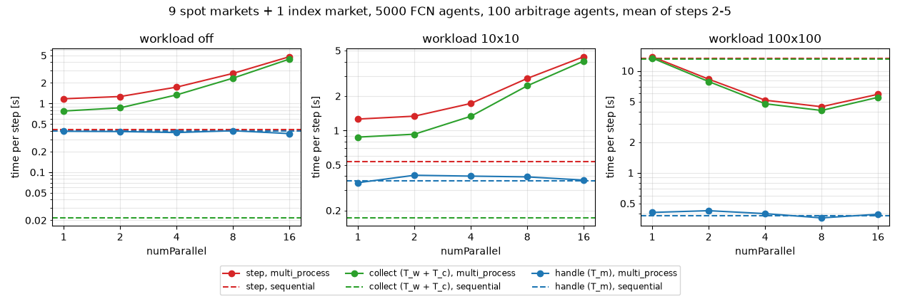

Parallel simulation (ParallelMain of Plham)
===========================================

This tutorial reproduces the `ParallelMain tutorial <https://plham.github.io/tutorial/ParallelMain>`_ of Plham, the
predecessor of PAMS, with the parallel runners of PAMS. The model is the shock transfer model with many spot
markets: an index market is made of N spot markets, the fundamental price of one spot market falls, and arbitrage
agents carry the shock to the index market. There are hundreds of agents on each market. A parallel runner shares
their decisions among its workers, while the orders are still executed one by one.

The files are in ``samples/parallel_main``:

- ``main.py`` runs a config with the runner chosen on the command line. It is the counterpart of ``ParallelMain``
  of Plham.
- ``workload_fcn_agent.py`` defines ``WorkloadFCNAgent``, an FCN agent with an extra computational workload.
- ``make_config.py`` generates the config for any number of spot markets. It is the counterpart of
  ``config.json.sh`` of Plham.
- ``config-002.json``, ``config-009.json`` and ``config-099.json`` are the configs with 2, 9 and 99 spot markets,
  as in Plham. ``config.json`` is a small config for quick runs.
- ``benchmark.py`` measures the time per step of the runners.

Read :ref:`config-parallel` first. It explains how the parallel runners work and what they require of your code.

WorkloadFCNAgent
~~~~~~~~~~~~~~~~

A parallel runner pays off only when the decisions of the agents take much longer than sending the work to the
workers. The decision of the built-in :class:`~pams.agents.FCNAgent` is so light that a parallel run of FCN agents
is slower than a sequential run. Therefore, as in Plham, ``WorkloadFCNAgent`` adds an artificial workload. Every
time it is asked for orders on a market, it prices a European call option by a Monte Carlo simulation of the
Black-Scholes model and throws the price away. Then, with the probability ``orderRate``, it submits the orders of an
FCN agent; otherwise, it submits no orders.

.. literalinclude:: ../../../../samples/parallel_main/workload_fcn_agent.py
   :pyobject: WorkloadFCNAgent.submit_orders_by_market
   :language: python

The agent reads these keys in addition to those of :class:`~pams.agents.FCNAgent`:

.. list-table::
   :header-rows: 1
   :widths: 20 25 55

   * - Key
     - Value
     - Description
   * - ``orderRate``
     - number in [0, 1], fixed or random (see :ref:`config-jsonrandom`)
     - The probability that the agent submits orders when it is asked. Default: ``0.1``, as ``ORDER_RATE`` in
       ``run.sh`` of Plham.
   * - ``bsWorkload``
     - bool
     - Whether the agent processes the workload. Default: ``false``.
   * - ``bsNumSamples``
     - int ≥ 1
     - The number of price paths of the Monte Carlo simulation. Required if ``bsWorkload`` is ``true``.
   * - ``bsNumSteps``
     - int ≥ 1
     - The number of time steps of each path. Required if ``bsWorkload`` is ``true``.

The size of the workload is written as ``bsNumSamples`` x ``bsNumSteps`` below, for example 10x10. The option is
the same as in Plham: the initial price 100, the strike price 100, the risk-free rate 0.1, the volatility 0.3 and
the maturity 3.

The Monte Carlo simulation does not draw random numbers from the random number generator of the agent
(``self.prng``). Instead, ``compute_workload`` makes its own generator with a seed made of the agent ID, the market
ID and the time:

.. literalinclude:: ../../../../samples/parallel_main/workload_fcn_agent.py
   :pyobject: WorkloadFCNAgent.compute_workload
   :language: python

Therefore, the workload changes neither the orders nor the results of the simulation, and the same work is done in
every runner. You can turn the workload on and off, or change its size, and compare only the time taken.

Configs
~~~~~~~

``make_config.py`` builds the model of the sample of Plham:

- N spot markets, ``SpotMarket-1`` to ``SpotMarket-N``, and an index market ``IndexMarket-I`` made of them.
- 500 FCN agents on each market. Those on the index market put a smaller weight on the fundamental price
  (``fundamentalWeight`` 0.5 instead of 1.0).
- 100 arbitrage agents, which trade between the index market and the spot markets.
- A fundamental price shock of -10% on ``SpotMarket-1`` at time 0.
- One session of 500 steps. In each step, every FCN agent is asked for orders (``maxNormalOrders`` is
  10\ :sup:`10`). After the orders of each FCN agent that submits orders are handled, the arbitrage agents are
  asked in random order until one of them submits orders (``maxHighFrequencyOrders`` is 1).
- The FCN agents are ``WorkloadFCNAgent`` with the workload 10x10 and ``orderRate`` 0.1, as in ``run.sh`` of
  Plham.

The checked-in configs are generated as follows, and the options of ``make_config.py`` (see ``--help``) change the
scale:

.. code-block:: bash

   python -m samples.parallel_main.make_config 9 -o samples/parallel_main/config-009.json
   python -m samples.parallel_main.make_config 99 --steps 20 --agents-per-market 20 -o config-small.json

Runs at the full scale take long. On our machine, 500 steps of ``config-002.json`` took about 8 minutes with
:class:`~pams.runners.SequentialRunner`, and the time per step grows as the order books fill up.
``config-009.json``, with about three times as many agents, takes longer still. ``config-099.json`` is included to
follow Plham, but running it at the full scale is not practical in PAMS. On our machine, its first step alone took
more than 4 minutes with :class:`~pams.runners.SequentialRunner`. With 99 spot markets, most of the time goes to
matching the orders, because the whole order book is re-heapified for each execution, and to the arbitrage agents,
which trade on 100 markets. Make smaller configs with ``make_config.py`` instead. ``config.json`` has 2 spot
markets, 20 FCN agents on each market, 10 arbitrage agents and 20 steps, and it runs in about a second.

Running
~~~~~~~

Run the sample from the root of the repository, so that the worker processes can import ``WorkloadFCNAgent``:

.. code-block:: bash

   python -m samples.parallel_main.main --config samples/parallel_main/config.json --seed 1
   python -m samples.parallel_main.main --config samples/parallel_main/config.json --seed 1 --runner sequential
   python -m samples.parallel_main.main --config samples/parallel_main/config.json --seed 1 --num-parallel 4

``main.py`` chooses only the runner, and the model is given by the config. ``--runner`` is ``sequential``,
``multi_thread`` or ``multi_process`` (the default), and ``--num-parallel`` overrides ``simulation.numParallel``
of the config. For the same seed, the market logs of all the runners are identical; only the lines starting with
``#``, which show the time taken, differ. As the process runner requires, ``main.py`` creates and runs the runner
under ``if __name__ == "__main__":``.

Benchmark
~~~~~~~~~

``benchmark.py`` measures how the time per step changes with the runner and ``numParallel``:

.. code-block:: bash

   python -m samples.parallel_main.benchmark --output benchmark.csv --plot benchmark.png

With the default settings, it takes several minutes, most of them with the workload 100x100. On Windows, set the
environment variable ``OPENBLAS_NUM_THREADS=1`` first (see the last item below); otherwise, every process reserves
about 1.5 GB of memory. ``--plot`` requires matplotlib.

By default, it runs the model of ``config-009.json`` (9 spot markets, 5000 FCN agents and 100 arbitrage agents)
for 5 steps with the workload off, 10x10 and 100x100, with :class:`~pams.runners.SequentialRunner` and with
:class:`~pams.runners.MultiProcessAgentParallelRunner` at ``numParallel`` 1, 2, 4 and 8. Each step is split into
two phases:

- **collect**: the normal agents decide their orders. For the parallel runners, this includes sending the agents
  to the workers and receiving the orders. In the terms of Torii et al. (2017), it is T_w + T_c, the work of the
  agents plus the communication.
- **handle**: the orders are executed and the high-frequency agents (here, the arbitrage agents) are asked for
  orders. It is T_m, the work of the master, and it is always sequential.

The two phases together are shown as "step". They do not include the events and the updates of the markets between
the steps. The first step, which includes starting the worker processes, is excluded from the means. Because the
time per step grows as the order books fill up, compare the runners with each other rather than with a full run. All
the runs must give the same results, and the benchmark raises an error if they do not. See ``--help`` for the other
options.

The figure and the table below show the results on our machine: Windows 11, an Intel Core i7-14700K with 28
logical processors, 64 GB of memory and Python 3.14, on 2026-10-01. We ran the command above with
``--num-parallel 1 2 4 8 16 --repeat 3`` and the environment variable ``OPENBLAS_NUM_THREADS=1`` (see the last item
below). Other jobs were running on the machine at the same time, so the numbers show only the trends: the slowest
of the three runs of a setting took up to about 30% longer than the fastest, and up to about 70% longer for the
times below 0.5 seconds.

         numParallel, with the workload off, 10x10 and 100x100

   The mean time per step of steps 2 to 5, the median of three runs, with 9 spot markets, 5000 FCN agents and 100
   arbitrage agents. The red, green and blue lines are the two phases together (step), the collect phase and the
   handle phase. The solid lines are :class:`~pams.runners.MultiProcessAgentParallelRunner`, and the dashed lines
   are :class:`~pams.runners.SequentialRunner`. Measured on 2026-10-01 on a Windows 11 machine with 28 logical
   processors and Python 3.14, while other jobs were running on it.

.. list-table:: The time per step of the collect phase with the workload 100x100 (median of three runs)
   :header-rows: 1
   :widths: 50 25 25

   * - Runner
     - collect [s]
     - Speed-up
   * - :class:`~pams.runners.SequentialRunner`
     - 13.0
     - 1.0
   * - Process runner, ``numParallel`` 1
     - 13.3
     - 1.0
   * - Process runner, ``numParallel`` 2
     - 7.8
     - 1.7
   * - Process runner, ``numParallel`` 4
     - 4.8
     - 2.7
   * - Process runner, ``numParallel`` 8
     - 4.1
     - 3.2
   * - Process runner, ``numParallel`` 16
     - 5.5
     - 2.4

- With the workload off or 10x10, the process runner is slower than the sequential runner, and it gets slower still
  as ``numParallel`` grows. Every task copies the whole simulation, about 20 MB here, to a worker. It takes about
  0.2 seconds to pickle and as long to unpickle, while the decisions of all the FCN agents take less than 0.2
  seconds per step with the workload 10x10. Because the main process pickles the tasks one by one, T_c grows with
  the number of tasks, that is, with ``numParallel``.
- With the workload 100x100, the decisions take about 13 seconds per step, and the process runner cuts the collect
  phase to 4.1 seconds with 8 workers, about 3.2 times faster. With 16 workers, it is slower again, because T_c
  grows while the work of each worker shrinks.
- The handle phase does not depend on the runner or ``numParallel``; it stays at about 0.4 seconds per step. As
  Amdahl's law says, it limits the speed-up of the two phases together. T_m limits the speed-up in the same way in
  Fig. 5 of Torii et al. (2017), with 100 markets. In their Fig. 4, with 10 markets, which is the figure of the
  Plham tutorial, the curve flattens at 64 nodes mainly because T_c grows.
- :class:`~pams.runners.MultiThreadAgentParallelRunner` does not speed up this workload, because the workload is
  pure Python code, and the global interpreter lock (GIL) of the standard build of Python lets only one thread run
  Python code at a time. In a separate run with the workload 100x100, its collect phase took 10.7 to 15.6 seconds
  per step with ``numParallel`` 2 to 16, against 12.5 seconds with the sequential runner, which is within the
  variation between runs.
- Each worker process holds a copy of the simulation, so the memory grows with ``numParallel``. With 16 workers,
  the 17 processes reserved about 4 GB in total. On Windows, however, NumPy and SciPy, which PAMS imports, also
  reserve (commit) about 0.75 GB each for OpenBLAS in every process, although they use little of it. The amount
  depends on the number of threads of OpenBLAS, which is the number of logical processors by default. Without
  ``OPENBLAS_NUM_THREADS=1``, a run with 16 workers reserves about 25 GB in total. On our shared machine, this
  exceeded the commit limit, and a worker failed with ``MemoryError``. With the variable, importing PAMS reserves
  about 45 MB per process instead of 1.5 GB, and the results are the same.

In short, the process runner pays off only when ``submit_orders`` takes much longer than copying the simulation, and
a few workers give most of the speed-up. For light agents, use :class:`~pams.runners.SequentialRunner`.

Differences from Plham
~~~~~~~~~~~~~~~~~~~~~~

- **Runner.** The parallel runner of Plham keeps the agents in its workers (MPI processes, possibly on many
  nodes) for the whole run and sends them only the changes of the markets in each step. The process runner of PAMS
  uses a pool of processes on one machine and, in each step, copies the agents together with the whole simulation
  to the workers. This is why PAMS needs a much heavier workload than 10x10 before a parallel run pays off. The
  figure of the Plham tutorial (Fig. 4 of Torii et al. (2017)) was measured with 4 to 64 nodes of the K computer,
  and the paper goes up to 256 nodes, so only the shapes of the curves can be compared with those here.
- **Determinism.** In PAMS, every runner gives the same results as :class:`~pams.runners.SequentialRunner` for the
  same seed. The parallel runner of Plham does not shuffle the agents as its sequential runner does, and it joins
  the orders of its workers (and of their threads) in the order in which they finish. Therefore, its results
  differ from those of the sequential runner and can change from run to run.
- **Events.** ``ParallelMain`` of Plham creates no events, so its parallel runs have no price shock even though
  the config enables it. PAMS keeps the shock in every runner; ``make_config.py --no-shock`` removes it.
- **Random numbers of the workload.** The workload of Plham draws from the random number generator of the agent,
  so turning the workload on changes the orders. In PAMS, it has its own generator, as explained above.
- **Discarded price.** Plham adds the option prices to a variable of the agent (``bsSum``). PAMS throws the price
  away; Python still computes it, and ``submit_orders`` changes no state of the agent.
- **Parameters.** Plham reads the environment variables ``BS_WORKLOAD``, ``BS_NSAMPLES``, ``BS_NSTEPS`` and
  ``ORDER_RATE``. PAMS reads the config keys ``bsWorkload``, ``bsNumSamples``, ``bsNumSteps`` and ``orderRate``,
  which can differ between agent groups.
- **Workers.** ``numParallel`` (or ``--num-parallel``) corresponds to the number of worker places of Plham,
  ``X10_NPLACES - 1``, because place 0 is the master. Plham also splits the agents of each worker over
  ``X10_NTHREADS`` threads, which PAMS has no counterpart for.
- **Version of the agent.** The agent of the Plham tutorial calls itself again instead of the FCN agent, so it never
  submits orders; the later version (v0.3) fixes this. PAMS follows v0.3. In addition, PAMS draws no random number
  for ``orderRate`` when it is 1.0, so that the agent then behaves exactly as :class:`~pams.agents.FCNAgent`.
- **Configs.** The configs of the Plham tutorial use ``FCNAgent``, although the text uses ``WorkloadFCNAgent``;
  those of PAMS use ``WorkloadFCNAgent``. ``maxHifreqOrders`` is ``maxHighFrequencyOrders`` in PAMS. The arbitrage
  agents list the spot markets as well as the index market, because an agent of PAMS can trade only on the markets
  it lists.
- **Measurement.** The figure of Plham shows the time of whole runs against the number of nodes. The benchmark of
  PAMS measures the time per step of the first steps, because full runs take long.
- **Language.** PAMS is written in Python, not X10. The classes that the process runner uses must be importable
  from a ``.py`` file.

References
~~~~~~~~~~

- Torii, T., Kamada, T., Izumi, K. and Yamada, K. (2016). Platform Design for Large-Scale Artificial Market
  Simulation and Preliminary Evaluation on the K computer. The 21st International Symposium on Artificial Life and
  Robotics (AROB 21st), OS10-2.
- Torii, T., Kamada, T., Izumi, K. and Yamada, K. (2017). Platform design for large-scale artificial market
  simulation and preliminary evaluation on the K computer. Artificial Life and Robotics, 22(3), 301-307.
  https://doi.org/10.1007/s10015-017-0368-z
- Plham tutorial, ParallelMain: https://plham.github.io/tutorial/ParallelMain
