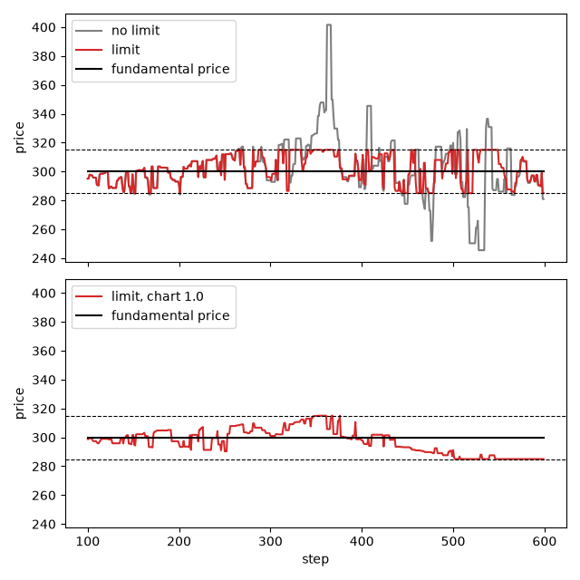

.. _tutorial-price-limit:

Price limits
============

A price limit keeps the prices of orders within a band around a reference price.
This tutorial follows the Plham tutorials `PriceLimitMain <https://plham.github.io/tutorial/PriceLimitMain>`__ and
`PriceLimitMain_UseCases <https://plham.github.io/tutorial/PriceLimitMain_UseCases>`__: it runs the same market
with and without a price limit, measures how long the price stays at a limit, and checks whether trend-following
agents make these stays longer.
The complete script is :download:`tutorial_price_limit.py <code/tutorial_price_limit.py>`.
It needs `matplotlib <https://matplotlib.org/>`_ for the plot, which is not installed with PAMS
(``pip install matplotlib``).

The model
---------

The market has 100 :class:`~pams.agents.FCNAgent` agents. Each agent expects a future price from a weighted mix of
three terms: the gap to the fundamental price, the recent trend (the chart term) and noise. It places a buy order
below its expected price if this price is above the market price, and a sell order above it otherwise.

:class:`~pams.events.PriceLimitRule` checks the price of every limit order before the market receives it.
Let :math:`P_0` be the market price at step 0 and :math:`r` the rate ``triggerChangeRate``. An order priced at
:math:`P_0 (1 + r)` or above gets the price :math:`P_0 (1 + r)`, and an order priced at :math:`P_0 (1 - r)` or
below gets the price :math:`P_0 (1 - r)`. Market orders are not changed. Here :math:`P_0 = 300` and
:math:`r = 0.05`. The agents of this tutorial place only limit orders, so all their orders are priced between 285
and 315, and so are all the trades.

Once the price reaches a limit, it tends to stay there. When many agents expect a price above 315, their buy
orders above 315 all become buy orders at 315, and so do the sell orders above 315. They trade with each other at
exactly 315 until the agents change their minds. Trend followers keep expecting the price to go on in the same
direction, so they should keep the price at the limit longer.

The configuration
-----------------

The configuration is ``samples/price_limit/config.json`` of the repository, written as a Python dict:

.. literalinclude:: code/tutorial_price_limit.py
   :language: python
   :start-after: # [config-start]
   :end-before: # [config-end]

- The first session (steps 0 to 99) only fills the order book. The second session (steps 100 to 599) also
  executes the orders and lists the rule in its ``events``.
- ``{"expon": [0.2]}`` draws the weight of each agent from an exponential distribution with mean 0.2 (see
  :ref:`config-jsonrandom`). With a fundamental weight of 0.2, a chart weight of 0 and a noise weight of 1.0, the
  agents mostly follow noise.
- The market has no ``fundamentalVolatility``, so the fundamental price stays at 300.

Every key is explained in :ref:`config-events` and :ref:`config-agents`.

Running it
----------

``run_simulation`` changes three values of a copy of the configuration: whether the rule is on, the mean chart
weight of the agents, and the length of the second session:

.. literalinclude:: code/tutorial_price_limit.py
   :language: python
   :pyobject: run_simulation

A rule with ``"enabled": False`` does nothing. It still draws its random numbers, so a run with the rule off is
the same as the run with the rule on until the rule changes its first order.

``limit_stats`` reads the prices of the second session and counts the steps at each limit:

.. literalinclude:: code/tutorial_price_limit.py
   :language: python
   :pyobject: limit_stats

- A price counts as at a limit when it is within the tick size (0.00001) of it. Without the rule, prices beyond
  the limits also count.
- ``longest`` is the longest run of consecutive steps at a limit. A step without trades keeps the last price,
  so it counts too.
- ``activation_count`` of the rule is the number of orders whose price it changed. The rule is active from
  step 0 whichever session lists it, so this count includes the orders of the first session.
- A disabled event is not added to ``simulator.name2event``, so the count is 0 without the rule.

How long the price stays at a limit
-----------------------------------

The script first runs three cases with seed 42: the rule on, the rule off, and the rule on with a mean chart
weight of 1.0. It prints:

.. code-block:: text

   case              lowest  highest  upper  lower  longest  changed
   limit             285.00   315.00     99     34       20      296
   no limit          245.47   401.56    102     50       31        0
   limit, chart 1.0  285.00   315.00     13     89       54      236

Without the rule, the price moves between 245.47 and 401.56. It is at or above 315 in 102 of the 500 steps, and
at or below 285 in 50 steps. With the rule, the price never leaves the band: it is at 315 in 99 steps and at 285
in 34 steps, and the rule changed the prices of 296 orders.

The limit does not make extreme prices rarer: the price is at a limit in 133 steps, against 152 steps at or
beyond one without the rule. It only cuts off the extreme values. In this run the price does not stay at one limit
for long either. It arrives at a limit 32 times (21 times at 315 and 11 times at 285), and its longest stay is
20 steps.

The upper panel of the figure shows these two runs. Their prices are the same until step 147, when the price first
reaches a limit:

         with the limit it stays between the dashed lines at 285 and 315. Lower panel: with a chart weight of 1.0
         the price moves more slowly and stays at or near 285 from about step 500 to the end.

Stronger trend followers
------------------------

The third case raises the mean chart weight from 0 to 1.0. An agent divides its expected return by the sum of its
three weights, so a larger chart weight also makes the noise count less. In the lower panel of the figure, the
price moves more slowly. It reaches 315 at step 352 and stays there until step 361, then comes back to 315 twice,
the last time at step 376. It reaches 285 at step 502, and the last 54 steps are all at 285: the run ends while
the price is still at the limit.

One run is not enough to compare the cases, so the script repeats the runs with the rule on for the seeds 42 to 51
and the mean chart weights 0, 0.5 and 1.0. It prints the means over the 10 seeds, then the longest stay of each
seed:

.. code-block:: text

   chart weight  steps at a limit  longest stay  changed orders
            0.0             131.7          16.4           311.0
            0.5              95.2          21.0           261.8
            1.0              93.2          35.2           247.3
   longest stay of each seed:
            0.0   20  10   9  11  30  43  11  10  11   9
            0.5   32  15   8  17  12  51  12  39  11  13
            1.0   54  13  13  94  80  11  43  15  16  13

- With stronger trend followers, the longest stay is longer on average: 35.2 steps with a chart weight of 1.0
  against 16.4 steps without trend followers. This is the effect the Plham tutorial describes.
- The effect varies a lot from seed to seed. With a chart weight of 1.0, six of the ten seeds have a longest
  stay of 16 steps or fewer, which is common without trend followers too. The mean comes mostly from the seeds
  45 (94 steps) and 46 (80 steps).
- Three of the stays (seeds 42, 46 and 48) last until the end of the run, so a longer run could make them
  longer. The Plham tutorial suggests about 5000 steps if the price does not reach a limit within 500 steps. The
  runs here keep the 500 steps of the configuration.
- The price spends fewer steps at a limit in total with trend followers (93.2 against 131.7), but in longer
  stays.

The script does not run the case without the limit and with a chart weight of 1.0. With such strong trend
followers and nothing to stop them, the price runs away: for seed 42 the run stops with an ``OverflowError``, and
for the seeds 43 and 44 the price falls to 0.00001, the tick size.

Running the script
------------------

Running the complete script with ``python tutorial_price_limit.py`` prints the two tables above and writes
``price_limit_prices.png`` to the current directory. It runs 33 simulations of 600 steps.

A trading halt stops the trading for a while instead of moving the order prices: see
:ref:`tutorial-trading-halt`.

Differences from Plham
----------------------

- Plham's tutorial limits the prices in two places: its agents keep their own orders inside the band, and the
  market enforces the band too. PAMS has only the market side. The :class:`~pams.agents.FCNAgent` agents do not
  know about the limit, and :class:`~pams.events.PriceLimitRule` moves their orders.
- Plham takes the reference price from a reference market. PAMS compares each market with its own price at
  step 0, which never changes, and ignores the ``referenceMarket`` key of older configurations with a warning.
- The numbers above are from PAMS with the seeds 42 to 51, and they do not match the figures of the Plham
  tutorial. In its first run, the price stays at the upper limit for a while from near step 200, then at the lower
  limit from near step 400. The runs here do not show this pattern: the price reaches the limits many more times,
  and without trend followers the longest stay in the ten seeds is 43 steps.

References
----------

- 水田孝信, 和泉潔, 八木勲, 吉村忍 (Mizuta, Izumi, Yagi and Yoshimura) (2013).
  人工市場を用いた値幅制限・空売り規制・アップティックルールの検証と最適な制度の設計.
  *IEEJ Transactions on Electronics, Information and Systems*, 133(9), 1694–1700.
  `doi:10.1541/ieejeiss.133.1694 <https://doi.org/10.1541/ieejeiss.133.1694>`__. The Plham tutorial lists a
  2009 version of this study.
- Chiarella, C. and Iori, G. (2002). A simulation analysis of the microstructure of double auction markets.
  *Quantitative Finance*, 2(5), 346–353. The FCN agents come from this model.
