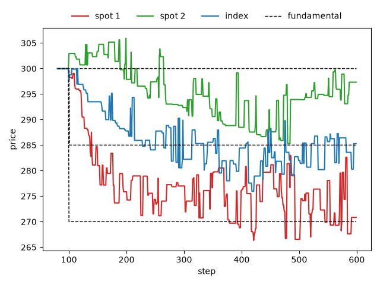

.. _tutorial-shock-transfer:

Shock transfer between markets through arbitrage
================================================

This tutorial follows the Plham tutorial of the same case
(`ShockTransferMain <https://plham.github.io/tutorial/ShockTransferMain>`__ and its
`use cases <https://plham.github.io/tutorial/ShockTransferMain_UseCases>`__), which is based on Torii, Nakagawa
and Izumi (2015).
There are two stocks, spot 1 and spot 2, and an index made of them. At step 100, bad news about spot 1 lowers its
fundamental price by 10%. Nothing happens to spot 2, but arbitrage agents trade it together with spot 1 and the
index. Does the shock reach spot 2 through them?
The complete script is :download:`tutorial_shock_transfer.py <code/tutorial_shock_transfer.py>`.
It needs `matplotlib <https://matplotlib.org/>`_ for the plot, which is not installed with PAMS
(``pip install matplotlib``).

The configuration
-----------------

The script uses the configuration of ``samples/shock_transfer`` as a Python dict:

.. literalinclude:: code/tutorial_shock_transfer.py
   :language: python
   :start-after: # [config-start]
   :end-before: # [config-end]

- ``SpotMarket-1`` and ``SpotMarket-2`` are the two stocks. Both take their settings from the ``SpotMarket``
  block with ``extends`` (see :ref:`config-extends`). Their prices start at 300, and their fundamental prices
  do not move by themselves.
- ``IndexMarket-I`` is an :class:`~pams.IndexMarket` made of the two stocks. Its fundamental price is the mean
  of the fundamental prices of the two stocks, because both have the same ``outstandingShares`` (see
  :ref:`config-indexmarket`). The index has its own order book, so its market price can differ from the
  **index value**, the mean of the market prices of the two stocks.
- ``FCNAgents-1``, ``FCNAgents-2`` and ``FCNAgents-I`` are 100 FCN agents each, and each group trades only in its
  own market. They share the settings of the ``FCNAgent`` block, which are those of :doc:`ci2002` without
  ``meanReversionTime``.
- ``ArbitrageAgents`` are 100 :class:`~pams.agents.ArbitrageAgent` agents that trade in all three markets.
- The first session (100 steps) only fills the order books, and ``maxHighFrequencyOrders: 0`` keeps the arbitrage
  agents off. The second session (500 steps) executes the orders. In each step, up to 3 FCN agents place orders,
  and after each of them up to 5 arbitrage agents can act (see :ref:`config-sessions`).
- The second session lists the ``FundamentalPriceShock`` event (see :ref:`config-events`). ``triggerTime``
  counts from the start of the session, so 0 means step 100. At that step, the fundamental price of spot 1 is
  multiplied by 1 − 0.1, from 300 to 270.

How the shock can spread
------------------------

An arbitrage agent compares the index market price with the index value.
When the index market price is lower by more than ``orderThresholdPrice`` (1.0), it buys 2 shares of the index
and sells 1 share of each stock. When it is higher by more than 1.0, it does the opposite.
Its orders are limit orders at the current market prices and last one step, so most of them are not executed.

The FCN agents of spot 2 only look at spot 2, whose fundamental price stays at 300.
Only the arbitrage agents can move spot 2 away from 300.
After the shock, spot 1 moves toward 270 and the index toward 285, the mean of 270 and 300.
Once every market is at its fundamental price, the index value is also 285, and there is nothing to trade.
The shock can reach spot 2 while the markets are moving:

- If spot 1 falls faster than the index, the index market price is above the index value. The arbitrage agents
  sell the index and buy the two stocks, which pushes spot 2 up.
- If the index falls faster than spot 1, the index market price is below the index value. The arbitrage agents
  buy the index and sell the two stocks, which pushes spot 2 down.

Running it
----------

``run_simulation`` runs the configuration with one seed. It can change the mean ``fundamentalWeight`` of the FCN
agents of spot 1 and of the index, and the number of steps of the second session:

.. literalinclude:: code/tutorial_shock_transfer.py
   :language: python
   :start-after: # [run-start]
   :end-before: # [run-end]

``python tutorial_shock_transfer.py`` first runs the sample with seed 42. It prints the market prices of the
three markets and the fundamental prices of spot 1 and of the index at a few steps:

.. code-block:: text

   step  spot 1  spot 2   index  fund 1  fund I
     99  300.00  300.00  300.00  300.00  300.00
    100  298.63  302.96  297.75  270.00  300.00
    101  298.27  302.96  298.75  270.00  285.00
    150  280.96  303.34  293.49  270.00  285.00
    200  275.87  297.86  287.77  270.00  285.00
    300  276.99  292.36  282.22  270.00  285.00
    599  270.84  297.32  285.30  270.00  285.00

- Until step 99, no order is executed, and every price is 300.
- At step 100, the fundamental price of spot 1 falls to 270. The fundamental price of the index follows one step
  later: the index computes its fundamental price for a step at the end of the step before, when the shock has
  not happened yet.
- Spot 1 and the index then move toward their new fundamental prices.

It also saves ``shock_transfer_prices.png``:

         270, 300 and 285 after the shock as dashed lines

Between steps 300 and 499, spot 2 is about 291 on average and falls to 285.24 at step 480, although its fundamental
price stays at 300.
In this run, spot 1 stays above its new fundamental price of 270 until step 379, while the index falls below 285
at step 228 and down to 275.94 at step 418.
The index market price is then below the index value on average, so the arbitrage agents more often buy the index
and sell the stocks than the opposite. In total, they sell 26 shares of spot 2 and buy 18 shares of the index.
This is the shock transfer.
They also end the run with 18 more shares of spot 1: their sell orders for spot 1 add up to 3260 shares and their
buy orders to only 2715, but more of the buy orders are executed (597 shares against 579).

Which market reacts first
-------------------------

The two use cases of the Plham tutorial change how fast spot 1 and the index react to the shock.
The script compares three cases:

.. literalinclude:: code/tutorial_shock_transfer.py
   :language: python
   :start-after: # [cases-start]
   :end-before: # [cases-end]

The noise weight stays 1.0, so with a fundamental weight of 0.1 the agents are mostly noise traders, and their
market moves only slowly toward its new fundamental price.
``compare`` runs each case with the ten seeds 42 to 51 and averages ``measure`` over them. To keep the run
short, the second session has only 100 steps:

.. literalinclude:: code/tutorial_shock_transfer.py
   :language: python
   :pyobject: measure

After the prices, the script prints one line per case:

.. code-block:: text

   case                premium spot 2    up arb spot 2 arb index
   same speed            -0.16  -0.18  4/10        0.0       5.9
   spot reacts faster     0.53   0.35  7/10        2.3      -0.1
   index reacts faster   -0.46  -0.51  4/10       -4.1      11.9

- ``premium`` is the index market price minus the index value. ``spot 2`` is the market price of spot 2 minus
  300. Both are means over the second session.
- ``up`` is the number of seeds where spot 2 is above 300 on average.
- ``arb spot 2`` and ``arb index`` are the numbers of shares of spot 2 and of the index that the arbitrage agents
  bought in total. A negative number means that they sold.

When spot 1 reacts faster, the premium is positive: the arbitrage agents buy spot 2, and spot 2 is above 300 in 7
of the 10 seeds. When the index reacts faster, the premium is negative: the arbitrage agents buy the index and
sell spot 2, and spot 2 is lower than in the other cases. This is the direction of the Plham tutorial, where spot 2
rises in the first case and falls in the second.

The effect is small. In the table, spot 2 moves by less than one price unit on average, while in the run of seed 42
it is about 9 below 300 between steps 300 and 499 (see the plot). Other seeds change the details. With the seeds
52 to 61, spot 2 is 0.08 below 300 on average when spot 1 reacts faster, and above 300 in only 4 of the 10 seeds,
but it is still higher than when the index reacts faster. With these seeds, ``same speed`` and
``index reacts faster`` also swap places in the ``spot 2`` column. What stays the same are the signs of the
premium and of ``arb spot 2`` when spot 1 or the index reacts faster, and they show the mechanism more clearly.
With the whole second session, ``compare(SEEDS, main_steps=500)`` gives the same order of the three cases, but
takes several times longer.
Not all the orders of the arbitrage agents are executed, so ``arb index`` is not exactly −2 × ``arb spot 2``.

Differences from Plham
----------------------

- In PAMS, the ``markets`` of the arbitrage agents must list the component markets as well as the index (see
  ArbitrageAgent in :ref:`config-agents`). The sample does this.
- PAMS and Plham use different random number generators, so the same configuration and seed give different
  prices.
- The Plham tutorial asks you to run ten or more trials of each case. This tutorial runs ten seeds, with a
  shorter second session, and prints the means.

References
----------

- 鳥居拓馬, 中川勇樹, 和泉潔 (2015). 複数資産人工市場を用いた裁定取引によるショック伝搬の分析. 人工知能学会全国大会論文集,
  JSAI2015, 1J4-OS-13a-2 (in Japanese). https://doi.org/10.11517/pjsai.JSAI2015.0_1J4OS13a2
- Torii, T., Izumi, K. and Yamada, K. (2015). Shock transfer by arbitrage trading: analysis using multi-asset
  artificial market. *Evolutionary and Institutional Economics Review*, 12(2), 395–412.
  https://doi.org/10.1007/s40844-015-0024-z
