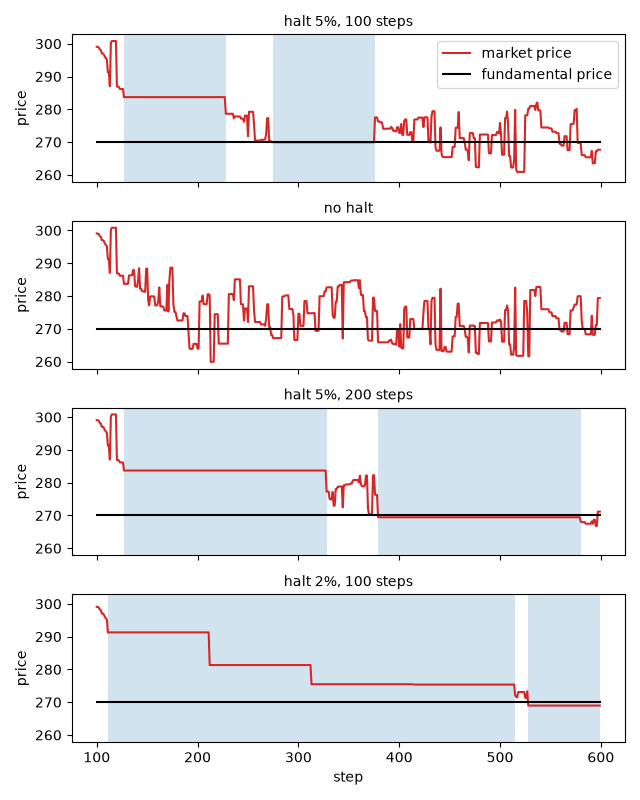

.. _tutorial-trading-halt:

Trading halts
=============

A trading halt, or circuit breaker, stops the trading of a market for a while when its price has moved too far.
This tutorial follows the Plham tutorials `TradingHaltMain <https://plham.github.io/tutorial/TradingHaltMain>`__
and `TradingHaltMain_UseCases <https://plham.github.io/tutorial/TradingHaltMain_UseCases>`__: the fundamental price
falls by 10%, and the market follows it with and without halts, with longer halts, and with a lower threshold.
The complete script is :download:`tutorial_trading_halt.py <code/tutorial_trading_halt.py>`.
It needs `matplotlib <https://matplotlib.org/>`_ for the plot, which is not installed with PAMS
(``pip install matplotlib``).

The model
---------

The market has 100 :class:`~pams.agents.FCNAgent` agents, which expect a future price from the gap to the
fundamental price, the recent trend and noise, and place orders around this price.
At step 100, :class:`~pams.events.FundamentalPriceShock` lowers the fundamental price from 300 to 270. The agents
then sell, and the market price falls towards 270.

:class:`~pams.events.TradingHaltRule` checks the market price :math:`P` after every trade. Let :math:`P_0` be the
market price at step 0, :math:`r` the rate ``triggerChangeRate`` and :math:`n` the number of halts so far. If

.. math::

   |P - P_0| \geq P_0 \, r \, (n + 1),

the rule halts all its target markets. While a market is halted, it still accepts orders and cancels, but it
executes nothing, so its price does not change. A halt that starts at step :math:`s` lasts until the end of step
:math:`s + L`, where :math:`L` is ``haltingTimeLength``, and the market trades again from step :math:`s + L + 1`.

Here :math:`P_0 = 300`. With :math:`r = 0.05`, the first halt comes when the price has moved by 5% (to 285 or
315), the second by 10% (270 or 330), and so on.

The Plham tutorial asks three questions: what the halts do after the shock, what longer halts do, and what a lower
threshold does.

The configuration
-----------------

The configuration is ``samples/trading_halt/config.json`` of the repository without its ``MEMO`` keys, written as a
Python dict:

.. literalinclude:: code/tutorial_trading_halt.py
   :language: python
   :start-after: # [config-start]
   :end-before: # [config-end]

- The first session (steps 0 to 99) only fills the order book. The second session (steps 100 to 599) also
  executes the orders and lists both events in its ``events``.
- ``triggerTime`` counts from the start of the session that lists the event, so the shock comes at step 100.
- The mean fundamental weight is 1.0 and the mean chart weight is 0 (see :ref:`config-jsonrandom`), so the agents
  are pulled towards the fundamental price, and there are no trend followers.

Every key is explained in :ref:`config-events` and :ref:`config-agents`.

The script compares four cases. They change the threshold, the length of a halt and whether the rule is on:

.. literalinclude:: code/tutorial_trading_halt.py
   :language: python
   :start-after: # [cases-start]
   :end-before: # [cases-end]

Running it
----------

``run_simulation`` changes these values in a copy of the configuration, and the length of the second session:

.. literalinclude:: code/tutorial_trading_halt.py
   :language: python
   :pyobject: run_simulation

A rule with ``"enabled": False`` does nothing. It still draws its random numbers, so a run with the rule off is
the same as the run with the rule on until the first halt.

The rule counts its halts in ``activation_count``, but it does not keep the steps of the halts. A logger (see
:doc:`custom_logger`) records them: at the end of each step, ``market.is_running`` is ``False`` while the market
is halted.

.. literalinclude:: code/tutorial_trading_halt.py
   :language: python
   :start-after: # [recorder-start]
   :end-before: # [recorder-end]

``halt_starts`` finds the first step of each halt in these steps. A halt covers :math:`L + 1` step ends, so a
halted step after them belongs to a new halt:

.. literalinclude:: code/tutorial_trading_halt.py
   :language: python
   :pyobject: halt_starts

``halt_stats`` sums up a run: the number of halts, the number of halted steps, the first step of each halt, the
lowest and the last market prices of the second session, and the number of shares traded in it. A disabled event
is not added to ``simulator.name2event``, so a run without the rule has no halts:

.. literalinclude:: code/tutorial_trading_halt.py
   :language: python
   :pyobject: halt_stats

Halts after the shock
---------------------

The script first runs the four cases with seed 42. It prints:

.. code-block:: text

   case                halts  halted  lowest    last  traded  halt starts
   halt 5%, 100 steps      2     202  260.91  267.66     191  127, 275
   no halt                 0       0  259.92  279.38     215  -
   halt 5%, 200 steps      2     402  266.82  271.17     148  127, 379
   halt 2%, 100 steps      5     476  268.97  268.97     141  111, 212, 313, 414, 528

The figure shows the prices of the four cases, with the halts shaded:

         halts, the price stays flat in the shaded halts. Without halts, it moves between 260 and 290. With the
         2% threshold, the market is halted almost all the time and the price falls in steps.

With halts of 100 steps at 5% (the first row and the first panel):

- The price falls after the shock. At step 127, a trade at 283.71, 5.4% below 300, starts the first halt.
- The market trades again from step 228. The orders placed during the halt trade at once: 27 shares change hands
  in this step, and the price moves to 278.64.
- At step 275, a trade at 269.95, 10.0% below 300, starts the second halt. After it, 24 shares trade at once at
  step 376. A third halt would need a fall of 15%, to 255, which does not happen.
- The market is halted at the end of 202 of the 500 steps: two halts of 101 steps.

Without halts (the second row), the run is the same until step 127. The price then falls below the new
fundamental price, to 259.92 at step 213, and ends at 279.38. In this run the halts hardly change the lowest
price (260.91 against 259.92). The runs with other seeds below show a clearer difference.

Longer halts
------------

The Plham tutorial then makes the halts 200 steps long. The effect of a halt should depend on its length compared
with the time windows of the agents, which are between 100 and 200 steps, so 200 steps is longer than any of them.
In PAMS, an FCN agent's order also stays in the book for as many steps as its time window, so no order placed
before a halt of 200 steps is left when the market trades again.

With 200 steps (the third row and panel), the halts start at steps 127 and 379, and the market is halted in 402 of
the 500 steps. The lowest price is 266.82, closer to 270 than in the first two cases, but only 148 shares trade,
against 215 without halts.

A lower threshold
-----------------

Last, the Plham tutorial lowers the threshold. The shock is 10%, so with a threshold of 2% the rule can halt the
market several times while the price follows the shock. With 2% (the last row and panel), the halts come at moves
of 2%, 4%, 6%, 8% and 10%, and the market halts five times, at steps 111, 212, 313, 414 and 528.

The halts at steps 212, 313 and 414 start in the step in which the market trades again, for two reasons:

- At step 212, the orders placed during the first halt trade at once. This jump moves the price from 291.28 (2.9%
  below 300) to 281.33 (6.2% below), past the threshold of 4%.
- At steps 313 and 414, the price is already past the next threshold when the market trades again: 281.33 is past
  6%, and 275.48, the price from step 313, is past 8%. The trades of these steps do not bring the price back, so
  the market halts again at once.

The market is halted at the end of 476 of the 500 steps, and the price falls in steps. The last halt lasts until
the end of the run, so the last price is also the lowest, 268.97.

Over ten seeds
--------------

The script repeats the four cases for the seeds 42 to 51 and prints the means:

.. code-block:: text

   case                halts  halted  lowest    last  traded
   halt 5%, 100 steps    2.0   202.0  258.79  265.60   191.3
   no halt               0.0     0.0  251.19  268.07   216.0
   halt 5%, 200 steps    2.0   399.7  265.61  268.66   136.3
   halt 2%, 100 steps    5.0   472.0  268.90  268.90   136.1

- Every seed has two halts at 5% and five at 2%.
- On average, the halts raise the lowest price: the mean lowest price is 251.19 without halts, 258.79 with halts
  of 100 steps, 265.61 with halts of 200 steps and 268.90 with the 2% threshold.
- The halts do not bring the last price closer to the new fundamental price of 270: the mean last price is 265.60
  with halts of 100 steps, against 268.07 without halts.
- The difference between the first two cases comes mostly from two seeds. Without halts, the lowest price is
  229.1 for seed 46 and 221.1 for seed 47. For the other eight seeds, it is between 255 and 260, close to the
  lowest prices with halts of 100 steps (255 to 262).
- The halts cost trading time. The market is halted in about 40%, 80% and 94% of the second session in the three
  cases with halts, and fewer shares trade.
- A halted market cannot trade, so it cannot fall either. With the 2% threshold, the price is frozen most of the
  time, and its lowest price says little about how the market would move.

Running the script
------------------

Running the complete script with ``python tutorial_trading_halt.py`` prints the two tables above and writes
``trading_halt_prices.png`` to the current directory. It runs 44 simulations of 600 steps.

A price limit keeps the market open and moves the order prices instead: see :ref:`tutorial-price-limit`.

Differences from Plham
----------------------

- Plham takes the reference price from a reference market. PAMS compares each market with its own price at
  step 0, which never changes, and ignores the ``referenceMarket`` key of older configurations with a warning.
- The numbers above are from PAMS with the seeds 42 to 51, and they do not match the figures of the Plham
  tutorial.

References
----------

- 清水季子, 村永淳 (Shimizu and Muranaga) (1999).
  取引停止措置が市場機能に及ぼす影響：人為的シャットダウンを備えた市場の挙動に関するシミュレーション分析.
  IMES Discussion Paper Series 99-J-1, Institute for Monetary and Economic Studies, Bank of Japan.
- 小林重人, 橋本敬 (Kobayashi and Hashimoto) (2006).
  サーキットブレーカー制度の有効性とその限界 ～人工市場シミュレーションによる検討～.
  MPSシンポジウム2006, 情報処理学会シンポジウムシリーズ, Vol. 2006, No. 10, 29–36. Cited by the Plham tutorial.
- Kobayashi, S. and Hashimoto, T. (2011). Benefits and limits of circuit breaker: institutional design using
  artificial futures market. *Evolutionary and Institutional Economics Review*, 7(2), 355–372.
  https://doi.org/10.14441/eier.7.355
- Chiarella, C. and Iori, G. (2002). A simulation analysis of the microstructure of double auction markets.
  *Quantitative Finance*, 2(5), 346–353. The FCN agents come from this model.
